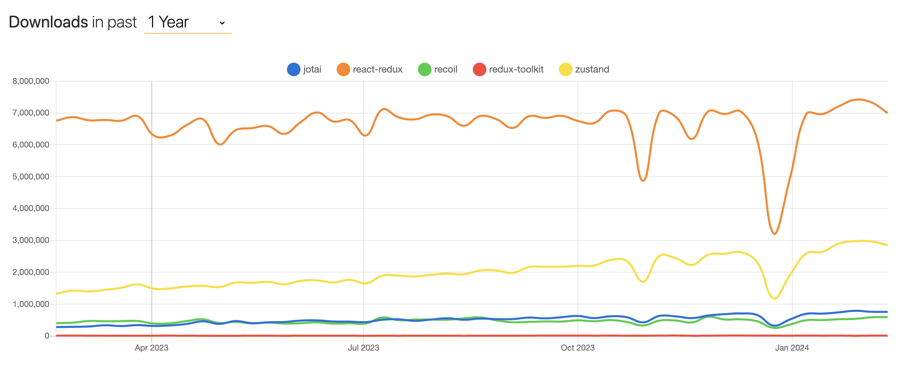

## 상태관리 라이브러리

상태관리 접근 방식에 따라 `Flux`, `Proxy`, `Atomic` 방식으로 나눌 수 있다.

1. `Flux`아키텍처

-   대규모 애플리케이션에서 데이터 흐름을 일관성있게 관리하여 프로그램의 예측 가능성을 높이기 위해 만들어진 아키텍처
-   단방향 데이터 바인딩(새로운 데이터를 넣으면 처음부터 다시 시작됨)
-   액션 -> 디스패처 -> 스토어 -> 뷰

2. `Proxy`아키텍처

3. `Atomic`아키텍처

### 지금까지 사용해본 라이브러리(사용 이유와 장/단점)

| Jotai(https://jotai.org/)

Jotai는 사용한지 4개월 정도 된 상태인데, 이전에 사용했던 상태 관리 라이브러리에 비해 상대적으로 사용이 쉬웠다.

### Zustnd 라이브러리
